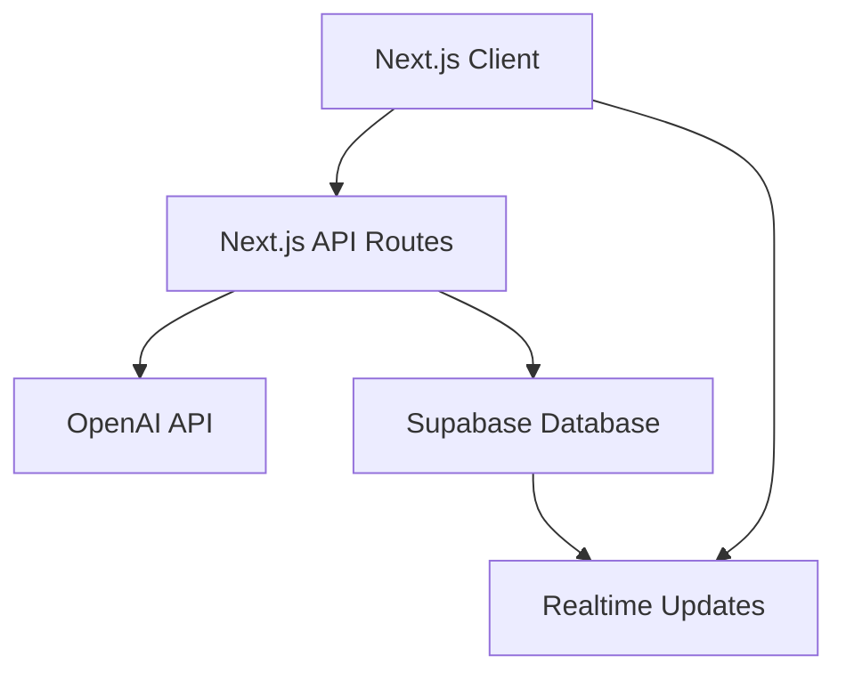

# System Architecture

## System Design

### High-Level Overview


## Data Flow

### Chat Flow
1. User sends message
2. Message stored in Supabase
3. OpenAI processes message
4. Response stored and broadcast
5. Real-time updates to all clients

### File Processing Flow
1. User uploads file
2. File stored in Supabase storage
3. File metadata stored in database
4. Processing status updates
5. File content available to agents

## Components

### Frontend Components
- ChatInterface
  - MessageList
  - InputArea
  - FileUpload
  - AgentSelector
- StatusIndicators
- ErrorBoundaries

### Backend Services
- MessageService
- AgentService
- FileService
- DatabaseService

## Deployment

### Infrastructure
- Vercel (Frontend + API)
- Supabase (Database + Storage)
- OpenAI (AI Processing)

### Environment Configuration
- Development
- Staging
- Production

## Schema

### Database Tables
```sql
-- Messages
CREATE TABLE messages (
    id UUID PRIMARY KEY,
    content TEXT NOT NULL,
    user_id UUID REFERENCES users(id),
    agent_id UUID REFERENCES agents(id),
    created_at TIMESTAMPTZ DEFAULT NOW(),
    updated_at TIMESTAMPTZ DEFAULT NOW()
);

-- Agents
CREATE TABLE agents (
    id UUID PRIMARY KEY,
    name TEXT NOT NULL,
    description TEXT,
    created_at TIMESTAMPTZ DEFAULT NOW()
);

-- Files
CREATE TABLE files (
    id UUID PRIMARY KEY,
    name TEXT NOT NULL,
    url TEXT NOT NULL,
    message_id UUID REFERENCES messages(id),
    created_at TIMESTAMPTZ DEFAULT NOW()
);
```
